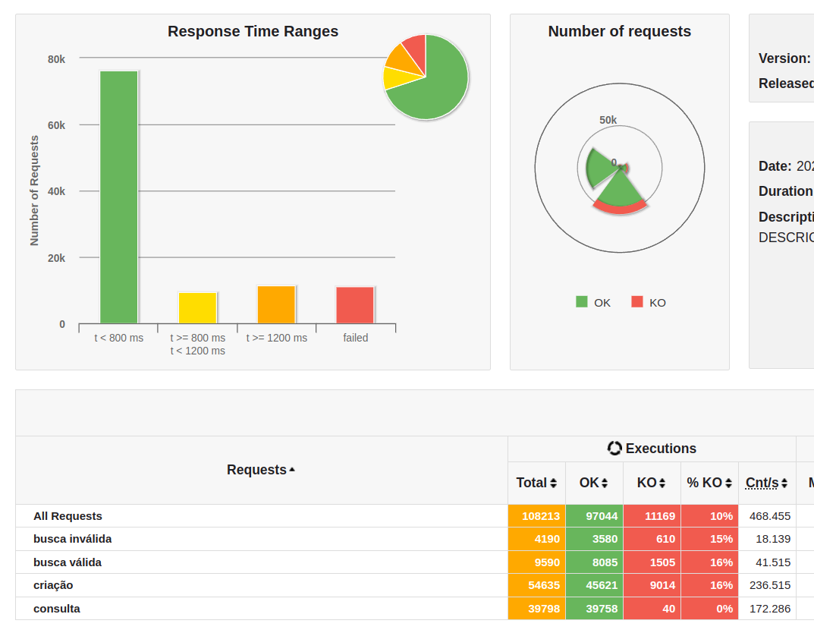
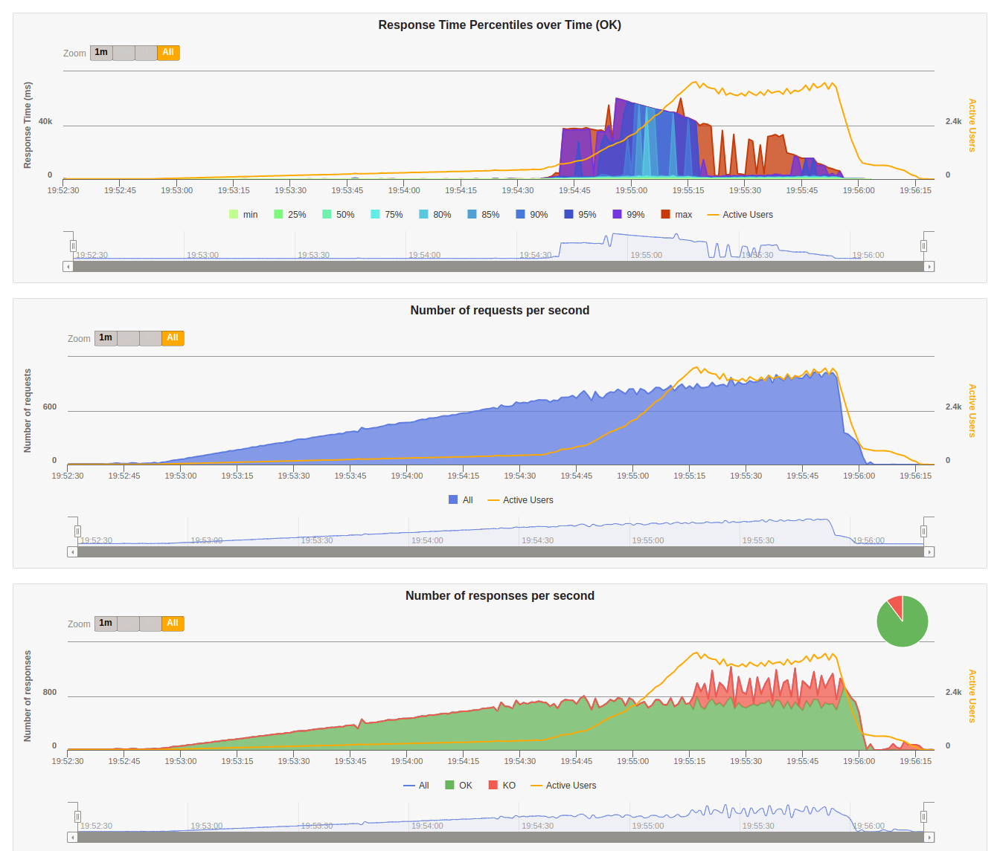

# Rinha Backend - API

This project was inspired by a community driven challenge that ran on August 2023:

Challenge [INSTRUCTIONS](https://github.com/zanfranceschi/rinha-de-backend-2023-q3/blob/main/INSTRUCOES.md):

Challenge [STRESS TEST](https://github.com/zanfranceschi/rinha-de-backend-2023-q3/blob/main/stress-test/run-test.sh)

Unfortunatelly I only heard about it a few days after it was closed, but I decided to try it out here.

The API itself is not the challenge, but to make it fit within the confines of a measle 1.5 vCPU and 3GB of RAM, and endure a very heavy, almost DDoS-like Gatling stress test. It's brutal test.

The goal of this version was to make a fully Rails API based app, with enough speed optimizations without completely breaking the framework. Some tricks are not recommended for real production usage, but it leverages the fact that this is a performance oriented challenge.

This version is OVERENGINEERED. I already missed the deadline anyway, so I went all in in experimentation. I implemented Rails.cache with Redis and async jobs with Sidekiq to queue up the inserts and another job to flush bulk inserts. You don't need it to peak in this stress test.

[@lazaronixon](https://github.com/lazaronixon/rinha_de_backend/) did a much simpler and straight forward version that already maxes out the stress test insertion criteria. But this is for fun.

I did had a discovery: I spent hours testing this thinking that my version had some bug that was keeping it down, below 20k even. But turns out that this line in docker-compose.yml is not working properly and I have no idea why:

    volumes:
      - ./postgresql.conf:/docker-entrypoint-initdb.d/postgresql.conf

In this config I had set a high max_connections, but the container was actually loading with just the default 100. That was the problem. You can check the database by connecting to it directly after loading docker compose up:

    ❯ docker-compose exec postgres psql -U postgres
        psql (15.4 (Debian 15.4-1.pgdg120+1))
        Type "help" for help.

        postgres=# SHOW max_connections;
        max_connections
        -----------------
        100
        (1 row)

To make sure it's actually increasing the max connections, I had to do:

    command: postgres -c 'max_connections=450'

### RESULTS

```
================================================================================
---- Global Information --------------------------------------------------------
> request count                                     108213 (OK=97044  KO=11169 )
> min response time                                      0 (OK=0      KO=3     )
> max response time                                  60001 (OK=60000  KO=60001 )
> mean response time                                  1855 (OK=1661   KO=3536  )
> std deviation                                       8622 (OK=7720   KO=14116 )
> response time 50th percentile                         25 (OK=90     KO=7     )
> response time 75th percentile                        602 (OK=684    KO=9     )
> response time 95th percentile                       1999 (OK=1980   KO=60000 )
> response time 99th percentile                      54713 (OK=52025  KO=60001 )
> mean requests/sec                                468.455 (OK=420.104 KO=48.351)
---- Response Time Distribution ------------------------------------------------
> t < 800 ms                                         76144 ( 70%)
> 800 ms <= t < 1200 ms                               9516 (  9%)
> t >= 1200 ms                                       11384 ( 11%)
> failed                                             11169 ( 10%)
---- Errors --------------------------------------------------------------------
> j.i.IOException: Premature close                                10512 (94.12%)
> Request timeout to localhost/127.0.0.1:9999 after 60000 ms        581 ( 5.20%)
> status.find.in(201,422,400), but actually found 502                51 ( 0.46%)
> status.find.in([200, 209], 304), found 502                         16 ( 0.14%)
> status.find.is(400), but actually found 502                         6 ( 0.05%)
> status.find.in(201,422,400), but actually found 504                 3 ( 0.03%)
================================================================================
```

It finished with almost 40K!! So this puts it near the top!!






### HOW TO RUN

To run this application:

    docker-compose up

Just for the first time run:

    docker-compose exec api1 rails db:create
    docker-compose exec api1 rails db:migrate

Application should respond at:

    http://0.0.0.0:9999


Run stress test:

    wget https://repo1.maven.org/maven2/io/gatling/highcharts/gatling-charts-highcharts-bundle/3.9.5/gatling-charts-highcharts-bundle-3.9.5-bundle.zip
    unzip gatling-charts-highcharts-bundle-3.9.5-bundle.zip
    sudo mv gatling-charts-highcharts-bundle-3.9.5-bundle /opt
    sudo ln -s /opt/gatling-charts-highcharts-bundle-3.9.5-bundle /opt/gatling

    cd ..
    git clone https://github.com/zanfranceschi/rinha-de-backend-2023-q3.git
    cd rinha-de-backend-2023-q3/stress-test

Edit the stress-test run-test.sh variables accordingly:

    GATLING_BIN_DIR=/opt/gatling/bin

    WORKSPACE=$HOME/Projects/rinha-de-backend-2023-q3/stress-test

Run the stress test:

    ./run-test.sh # after docker-compose up

On AWS EC2, create a t2.medium instance (2vCPUs 4GB RAM), download the .pem key:

    chmod 400 yourkey.pem
    ssh -i yourkey.pem -o IdentitiesOnly=yes ec2-user@yourinstanceaddress.com

SSH in:

    # Install Docker
    sudo amazon-linux-extras install docker
    sudo service docker start
    sudo usermod -a -G docker ec2-user

    # Install Docker Compose
    sudo curl -L "https://github.com/docker/compose/releases/download/1.29.2/docker-compose-$(uname -s)-$(uname -m)" -o /usr/local/bin/docker-compose
    sudo chmod +x /usr/local/bin/docker-compose

    # install Git
    sudo yum update -y
    sudo yum install git -y
    git clone https://github.com/akitaonrails/rinhabackend-rails-api.git

    # run docker compose
    cd rinhabackend-rails-api
    docker-compose up --force-recreate -d

Don't forget to change run-test.sh and RinhaBackendSimulation.scala to add your own PATH and HOST name (in case you're running on AWS EC2). Also don't forget to edit docker-compose.yml to not build locally, but fetch the image from docker.io.

And in case you're wondering how a more "realistic" setup would look like, I created a "docker-compose-ideal.yml" that breaks the 1.5 vCPU and 3GB of RAM to a whopping 30 vCPUs and 22GB of RAM. If you have the horsepower for that, run:

    docker-compose -f docker-compose-ideal.yml up --force-recreate --build
